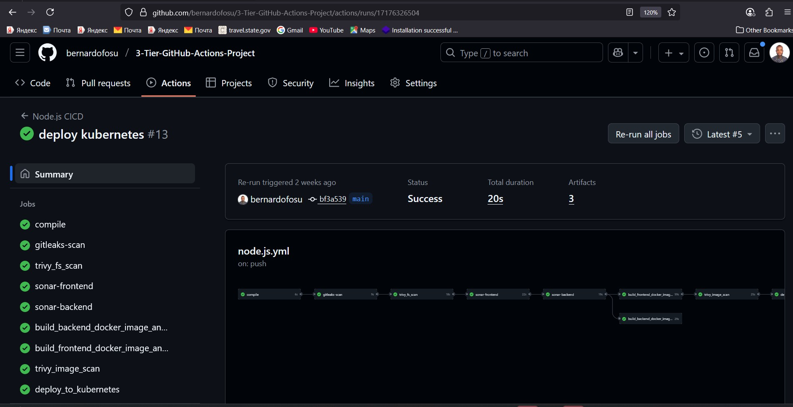

# 3-Tier DevSecOps Project

This repository contains a simple Node.js API and a React client used for a user management demo. Follow the steps below to get the project running locally.



## Setup

1. Install Node.js (version 18 or later is recommended).
2. Install dependencies for both the API and client:

   ```bash
   cd api && npm install
   cd ../client && npm install
   ```

3. Start the API server:

   ```bash
   cd api
   npm start
   ```

4. In a separate terminal, start the React client:

   ```bash
   cd client
   npm start
   ```

5. Open `http://localhost:3000` in your browser to use the application.

# 🚀 3-Tier DevSecOps CI/CD Platform (GitHub Actions & Kubernetes)

## 📌 Overview
This project demonstrates a **production-style 3-tier DevSecOps CI/CD platform**
built using **GitHub Actions** and **Kubernetes**.  
It automates the build, security scanning, containerization, and deployment of a
cloud-native application consisting of:

- **Frontend** – React
- **Backend API** – Node.js
- **Database** – Kubernetes-managed service

The pipeline applies **shift-left security**, container best practices, and
Kubernetes-native deployment patterns.

---

## 🧱 Architecture
**3-Tier Application Architecture**

User
↓
Frontend (React)
↓
Backend API (Node.js)
↓
Database (Kubernetes Service)

css
Copy code

**CI/CD Flow**
Code Push → GitHub Actions → Security Scans → Docker Build → Image Scan →
Kubernetes Deployment

markdown
Copy code

---

## 🔐 DevSecOps Pipeline Stages

The GitHub Actions workflow includes the following stages:

1. **Code Checkout**
2. **Dependency Installation & Build**
3. **Secret Detection**
   - Gitleaks (detects exposed secrets)
4. **Vulnerability Scanning**
   - Trivy filesystem scan
   - Trivy container image scan
5. **Code Quality Analysis**
   - SonarQube (frontend & backend)
6. **Containerization**
   - Docker image build for frontend & backend
7. **Deployment**
   - Kubernetes manifests applied automatically

Each stage must pass before deployment proceeds.

---

## 🛠️ Technology Stack

### CI/CD & DevSecOps
- GitHub Actions
- Gitleaks
- Trivy
- SonarQube

### Containers & Orchestration
- Docker
- Kubernetes

### Application
- Node.js (Backend API)
- React (Frontend)

### Platform & OS
- Linux
- Bash
- YAML

---

## ✅ Key Features
- End-to-end automated CI/CD pipeline
- Shift-left security with multiple scanning layers
- Kubernetes-native deployment
- Separate frontend and backend pipelines
- Production-style workflow (not a toy demo)
- Clear pipeline visibility via GitHub Actions

---

## ▶️ Pipeline Execution (Example)
Successful GitHub Actions workflow run includes:
- ✔ Compile
- ✔ Gitleaks scan
- ✔ Trivy filesystem scan
- ✔ SonarQube frontend analysis
- ✔ SonarQube backend analysis
- ✔ Docker image builds
- ✔ Trivy image scans
- ✔ Kubernetes deployment

---

## ⚙️ Local Setup (Optional)

### Prerequisites
- Node.js 18+
- Docker
- Kubernetes cluster (local or cloud)
- kubectl configured

### Run Locally
```bash
# Install backend dependencies
cd backend
npm install
npm start

# Install frontend dependencies
cd frontend
npm install
npm start
📂 Repository Structure
css
Copy code
.
├── backend/
│   ├── Dockerfile
│   └── src/
├── frontend/
│   ├── Dockerfile
│   └── src/
├── k8s/
│   ├── backend.yaml
│   ├── frontend.yaml
│   └── services.yaml
├── .github/
│   └── workflows/
│       └── nodejs.yml
└── README.md
🧠 Learning Outcomes
Designing secure CI/CD pipelines

Applying DevSecOps practices in GitHub Actions

Container security scanning

Kubernetes deployment automation

Managing multi-service applications

🎯 Use Case
This project serves as a reference implementation for:

Cloud DevOps Engineers

DevSecOps Engineers

Platform Engineers

Kubernetes-focused roles

🔗 Related
GitHub Actions

Kubernetes

DevSecOps best practices

Cloud-native application delivery

📄 License
This project is licensed under the MIT License.
